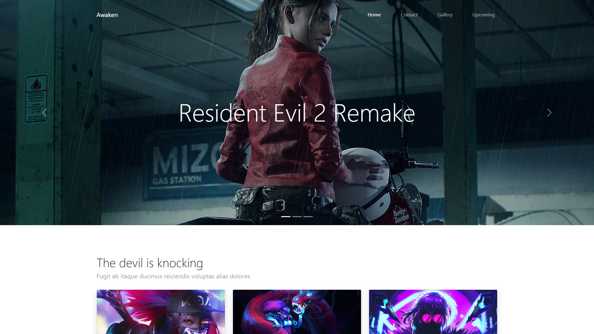
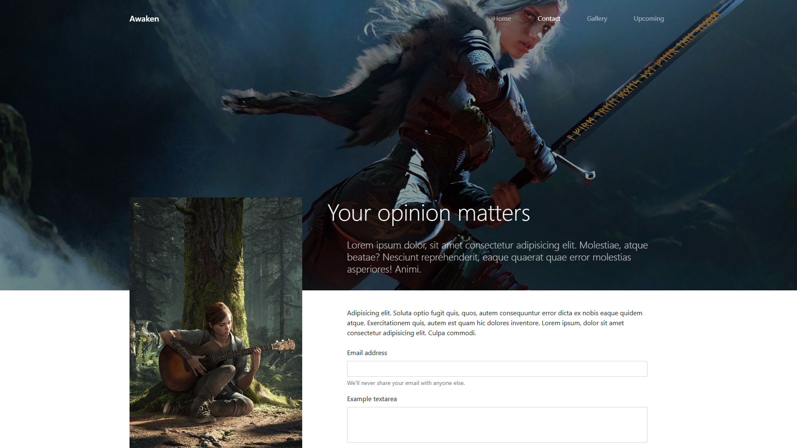
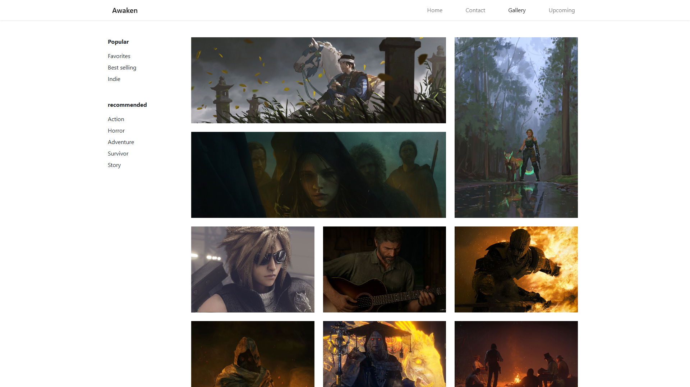
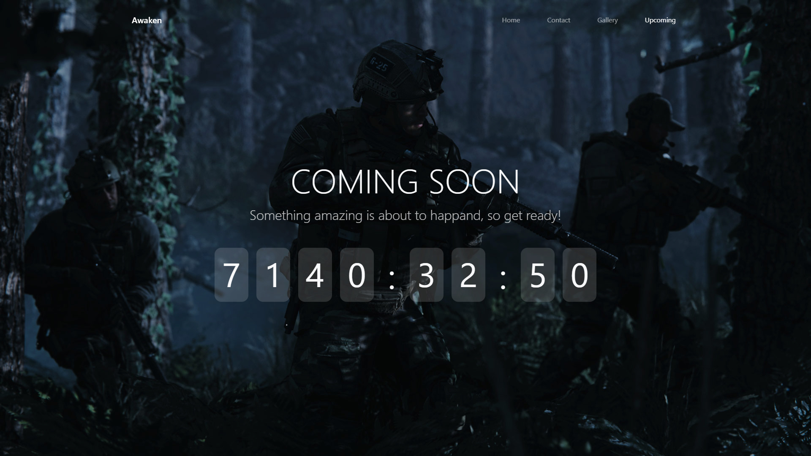

# Bootstrap v5 template

Live demo: [bootstrap-v5.vercel.app](https://bootstrap-v5.vercel.app)

This was a project required by cs50 problem set 8, but i decided to dive in a little more and make a bootstrap v5 project. There are four pages in this web app: Home, Contact, Gallery and Upcoming.

Home page has your typical landing page structure. I also added some javascript for a nice UI effect when the user starts scrolling. Contact page has an interactive form and when you submit your information a bootstrap modal pops up and shows your email address and message. You can look through a bunch of images in gallery page and click on each one to view it in full size. Upcoming page is the one that I wrote the most javascript for. It's a timer that counts down the hours, minutes and seconds remaining until next year. I also implemented custom UI and animations for the countdown.

## Screenshots

